# **Pemrograman Asynchronous**

## **Pratikum 1**

### **Langkah 1**

Buatlah sebuah project flutter baru dengan nama books di folder src week-12 repository GitHub Anda.

Kemudian Tambahkan dependensi http dengan mengetik perintah berikut di terminal.

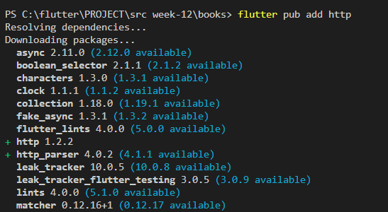

### **Langkah 2**

Jika berhasil install plugin, pastikan plugin http telah ada di file pubspec ini seperti berikut.

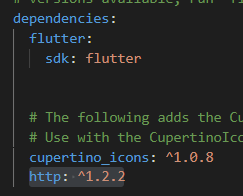

### **Langkah 3**

Ketiklah kode seperti berikut ini.

### ```Soal 1```

```
import 'package:flutter/material.dart';
import 'dart:async';
import 'package:http/http.dart';
import 'package:http/http.dart' as http;

void main() {
  runApp(const MyApp());
}

class MyApp extends StatelessWidget {
  const MyApp({super.key});

  @override
  Widget build(BuildContext context) {
    return MaterialApp(
      title: 'Future Demo Natan',
      theme: ThemeData(
        primarySwatch: Colors.blue,
        visualDensity: VisualDensity.adaptivePlatformDensity,
      ),
      home: const FuturePage(),
    );
  }
}

class FuturePage extends StatefulWidget {
  const FuturePage({super.key});

  @override
  State<FuturePage> createState() => _FuturePageState();
}

class _FuturePageState extends State<FuturePage> {
  String result = '';

  Future<Response> getData() async {
    const authority = 'www.googleapis.com';
    const path = '/books/v1/volumes/XTTMDwAAQBAJ';
    Uri url = Uri.http(authority, path);
    return https.get(url);
  }

  @override
  Widget build(BuildContext context) {
    return Scaffold(
      appBar: AppBar(
        title: const Text('Back from the Future'),
      ),
      body: Center(
        child: Column(
          children: [
            const Spacer(),
            ElevatedButton(
              child: const Text('GO!'),
              onPressed: () {},
            ),
            const Spacer(),
            Text(result),
            const Spacer(),
            const CircularProgressIndicator(),
            const Spacer(),
          ],
        ),
      ),
    );
  }
}
```

### **Langkah 4** 

Tambahkan method ini ke dalam class _FuturePageState yang berguna untuk mengambil data dari API Google Books.

```
Future<Response> getData() async {
    const authority = 'www.googleapis.com';
    const path = '/books.google.co.id/books?id=XTTMDwAAQBAJ&newbks=0&printsec=frontcover&pg=PA3&dq=naruto&hl=id&source=newbks_fb&redir_esc=y#v=onepage&q=naruto&f=false';
    Uri url = Uri.http(authority, path);
    return http.get(url);
  }
```

### ```Soal 2```

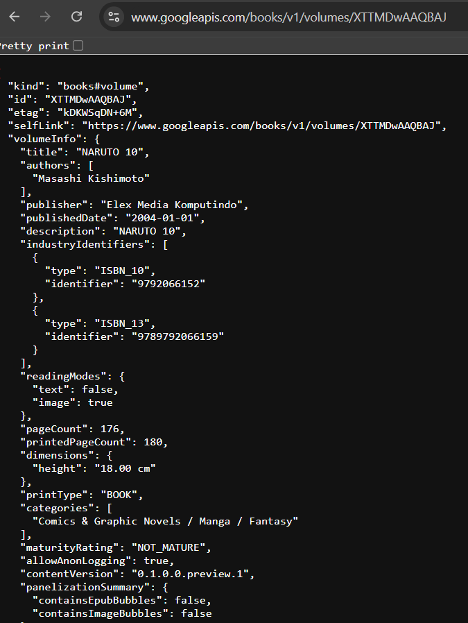

### **Langkah 5**

Tambahkan kode pada onPressed di ElevatedButton seperti berikut.

```
ElevatedButton(
              child: const Text('GO!'),
              onPressed: () {
                setState(() {});
                getData()
                .then((value){
                  result = value.body.toString().substring(0, 450);
                  setState(() {});
                }).catchError((_){
                  result = 'An error occurred';
                  setState(() {});
                });
              },
            ),
```

### ```Soal 3```


Jelaskan maksud kode langkah 5 tersebut terkait substring dan catchError!

**jawab**

* substring(0, 450) membatasi jumlah teks JSON yang ditampilkan menjadi 450 karakter.
* catchError menangani kesalahan jaringan atau respons, memungkinkan aplikasi menampilkan pesan kesalahan yang ramah pengguna jika ada masalah saat mengambil data.

## **Praktikum 2**

### **Langkah 1**

Tambahkan tiga method berisi kode seperti berikut di dalam class _FuturePageState.

```
Future<int> returnOneAsync() async {
    await Future.delayed(const Duration(seconds: 3));
    return 1;
  }

  Future<int> returnTwoAsync() async {
    await Future.delayed(const Duration(seconds: 3));
    return 2;
  }

  Future<int> returnThreeAsync() async {
    await Future.delayed(const Duration(seconds: 3));
    return 3;
  }
```

### **Langkah 2**

Lalu tambahkan lagi method ini di bawah ketiga method sebelumnya.

```
Future count() async {
    int total = 0;
    total = await returnOneAsync();
    total += await returnTwoAsync();
    total += await returnThreeAsync();
    setState(() {
      result = total.toString();
    });
  }
```

### **Langkah 3**

Lakukan comment kode sebelumnya, ubah isi kode onPressed() menjadi seperti berikut.

```
child: const Text('GO!'),
              onPressed: () {
                count();
              },
```

### ```Soal 4```

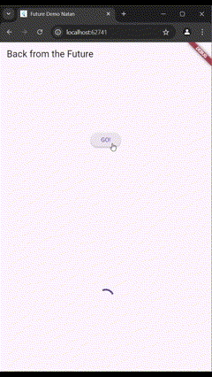

Jelaskan maksud kode langkah 1 dan 2 tersebut!

**jawab**

* Langkah 1: Membuat tiga fungsi yang masing-masing menunggu 3 detik sebelum mengembalikan angka 1, 2, dan 3.
* Langkah 2: Fungsi count() memanggil ketiga fungsi tersebut secara berurutan, menunggu setiap hasil, lalu menjumlahkan nilainya menjadi total 6. Hasil ini kemudian diupdate pada UI melalui setState().

## **Praktikum 3**

### **Langkah 1**

Pastikan telah impor package async berikut.
```
import 'package:async/async.dart';
```

### **Langkah 2**

Tambahkan variabel late dan method di class _FuturePageState seperti ini.
```
late Completer completer;

  Future getNumber() {
    completer = Completer<int>();
    calculate();
    return completer.future;
  }

  Future calculate() async {
    await Future.delayed(const Duration(seconds: 5));
    completer.complete(42);
  }
```

### **Langkah 3**

Tambahkan kode berikut pada fungsi onPressed(). Kode sebelumnya bisa Anda comment.
```
ElevatedButton(
              child: const Text('GO!'),
              onPressed: () {
                getNumber().then((value) {
                  setState(() {
                    result = value.toString();
                  });
                });
              },
              )
```

### **Langkah 4**

Terakhir, run atau tekan F5 untuk melihat hasilnya jika memang belum running. Bisa juga lakukan hot restart jika aplikasi sudah running. Maka hasilnya akan seperti gambar berikut ini. Setelah 5 detik, maka angka 42 akan tampil.

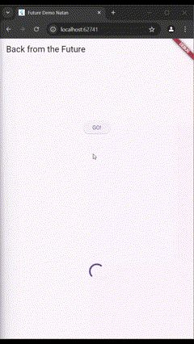

### ```Soal 5```

Jelaskan maksud kode langkah 2 tersebut!

Ringkasan Alur Eksekusi
* Ketika getNumber() dipanggil, completer diinisialisasi, lalu calculate() dijalankan, dan completer.future dikembalikan sebagai Future yang belum selesai.
* calculate() menunggu 5 detik, lalu menyelesaikan Future dengan nilai 42.
* Setelah 5 detik, Future yang dihasilkan oleh getNumber() akan berstatus selesai dan akan mengembalikan nilai 42.

Kesimpulan : Kode ini membuat proses asinkron di mana sebuah Future diselesaikan dengan nilai 42 setelah menunggu selama 5 detik.

### **Langkah 5**

Gantilah isi code method calculate() seperti kode berikut, atau Anda dapat membuat calculate2()
```
Future calculate2() async {
    try {
      await new Future.delayed(const Duration(seconds: 5));
      completer.complete(42);
    }
    catch(_){
      completer.completeError({});
    }
  } 
```

### **Langkah 6**

Ganti menjadi kode seperti berikut.
```
ElevatedButton(
              child: const Text('GO!'),
              onPressed: () {
                getNumber().then((value) {
                  setState(() {
                    result = value.toString();
                  });
                }).catchError((e) {
                  result = 'An error occured';
                });
              },
              )
```

### ```Soal 6```

Jelaskan maksud perbedaan kode langkah 2 dengan langkah 5-6 tersebut!

Perbedaan Utama antara Langkah 2 dan Langkah 5-6
* Error Handling: Langkah 5 menambahkan try-catch pada calculate2() untuk menangani error. Sebaliknya, pada kode di Langkah 2, calculate() tidak menangani error, jadi setiap error yang terjadi tidak ditangani secara langsung.
* Penggunaan .then() dan .catchError() pada Button: Di Langkah 6, button GO! sekarang menggunakan .then() dan .catchError() untuk mengelola baik nilai berhasil maupun error dari getNumber(). Ini memastikan bahwa setiap error yang terjadi di calculate2() atau getNumber() dapat ditangani dan ditampilkan ke pengguna.

## **Praktikum 4**

### **Langkah 1**

Tambahkan method ini ke dalam class _FuturePageState
```
void returnFG() {
    FutureGroup<int> futureGroup = FutureGroup<int>();
    futureGroup.add(returnOneAsync());
    futureGroup.add(returnTwoAsync());
    futureGroup.add(returnThreeAsync());
    futureGroup.close();
    futureGroup.future.then((List <int> value) {
      int total = 0;
      for (var element in value) {
        total += element;
      }
      setState(() {
        result = total.toString();
      });
    });
  }
```

### **Langkah 2**

Anda bisa hapus atau comment kode sebelumnya, kemudian panggil method dari langkah 1 tersebut.
```
ElevatedButton(
              child: const Text('GO!'),
              onPressed: () {
                returnFG();
              },
)
```

### **Langkah 3**

Anda akan melihat hasilnya dalam 3 detik berupa angka 6 lebih cepat dibandingkan praktikum sebelumnya menunggu sampai 9 detik.

### ```Soal 7```

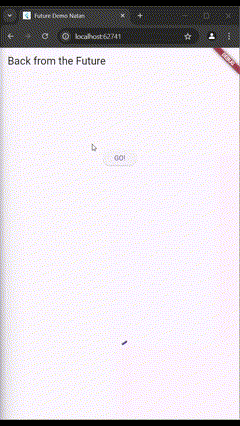

### **Langkah 4**

Anda dapat menggunakan FutureGroup dengan Future.wait seperti kode berikut.
```
void returnFG() {
    final futures = Future.wait<int>([
      returnOneAsync(),
      returnTwoAsync(),
      returnThreeAsync(),
    ]).then((List<int> value) {
      int total = 0;
      for (var element in value) {
        total += element;
      }
      setState(() {
        result = total.toString();
      });
    });
  }
```

### ```Soal 8```

Jelaskan maksud perbedaan kode langkah 1 dan 4!

**jawab**

perbedaan Langkah 1 (menggunakan FutureGroup) dan Langkah 4 (menggunakan Future.wait):
* Struktur dan Dependency:

FutureGroup memerlukan tambahan package async, sementara Future.wait adalah fungsi bawaan Dart yang tidak memerlukan dependency tambahan.
* Fleksibilitas Penambahan Future:

FutureGroup memungkinkan menambahkan Future secara dinamis satu per satu, kemudian ditutup dengan close() saat semua Future sudah dimasukkan. sedangkan Future.wait langsung menerima semua Future sebagai List, sehingga tidak fleksibel untuk penambahan Future secara bertahap.

## **Praktikum 5**

### **Langkah 1**
Tambahkan method ini ke dalam class _FuturePageState
```
Future returnError() async {
    await Future.delayed(const Duration(seconds: 2));
    throw Exception('Something terrible happend!');
  }
```

### **Langkah 2**
Ganti dengan kode berikut
```
ElevatedButton(
              child: const Text('GO!'),
              onPressed: () {
                // 
                returnError()
                .then((value) {
                  setState(() {
                    result = 'Success';
                  });
                }).catchError((onError) {
                  setState(() {
                    result = onError.toString();
                  });
                }).whenComplete(() => print('Complete'));
              },
            ),
```

### **Langkah 3**
Lakukan run dan klik tombol GO! maka akan menghasilkan seperti gambar berikut.

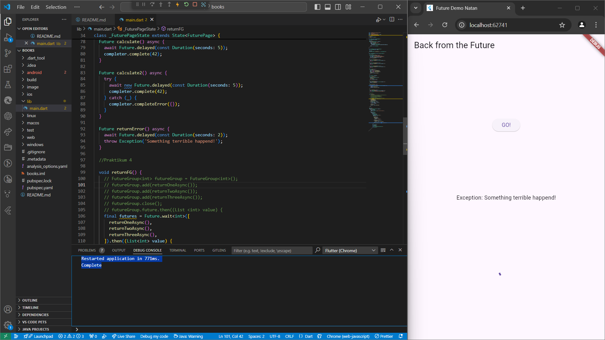

### ```Soal 9```


### **Langkah 4**

Tambahkan kode ini di dalam class _FutureStatePage
```
Future handleError() async {
    try{
      await returnError();
    }
    catch (error) {
      setState(() {
        result = error.toString();
      });
    }
    finally {
      print('complete');
    }
  }
```

### ```Soal 10```


Panggil method handleError() tersebut di ElevatedButton, lalu run. Apa hasilnya? Jelaskan perbedaan kode langkah 1 dan 4!

**jawab**

Berikut perbedaan utama antara kode di Langkah 1 dan Langkah 4:

1. Cara Penanganan Error:
* Langkah 1: Menggunakan then, catchError, dan whenComplete untuk menangani error secara terpisah setelah Future selesai dijalankan.
* Langkah 4: Menggunakan try-catch-finally di dalam method handleError() untuk menangkap error langsung dalam blok catch. Error dapat ditangani di dalam method tersebut tanpa perlu callback tambahan.
2. Kontrol dan Fleksibilitas:
* Langkah 1: catchError menangani error secara terpisah setelah pemanggilan then. Ini memungkinkan penanganan error, tetapi kode di luar catchError tidak terpengaruh langsung oleh error tersebut.
* Langkah 4: try-catch-finally memberikan fleksibilitas yang lebih besar karena error ditangani dalam satu method, memungkinkan penanganan yang lebih terstruktur dan integrasi kode setelah error dalam blok finally.
3. Kode Setelah Eksekusi (finally vs. whenComplete):
* Di Langkah 1, whenComplete dipanggil setelah Future selesai, baik itu berhasil atau gagal, mirip dengan finally, tetapi ditangani di luar method.
* Di Langkah 4, finally dalam try-catch-finally memastikan bahwa blok tertentu akan selalu dieksekusi setelah Future, terlepas dari berhasil atau gagal, memberikan kepastian eksekusi dalam satu tempat.

## **Praktikum 6**

### **Langkah 1**
Tambahkan plugin geolocator dengan mengetik perintah berikut di terminal.

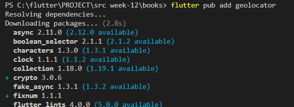

### **Langkah 2**

Jika Anda menargetkan untuk platform Android, maka tambahkan baris kode berikut di file android/app/src/main/androidmanifest.xml

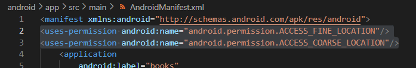

### **Langkah 3**

Tambahkan file baru ini di folder lib project Anda.

### **Langkah 4**

Buat class LocationScreen di dalam file geolocation.dart

### **Langkah 5**

```
import 'package:flutter/material.dart';
import 'package:geolocator/geolocator.dart';

class LocationScreen extends StatefulWidget {
  const LocationScreen({super.key});

  @override
  State<LocationScreen> createState() => _LocationScreenState();
}

class _LocationScreenState extends State<LocationScreen> {
  String myPosition = '';

  @override
  void initState() {
    super.initState();
    getPosition().then((Position myPos) {
      myPosition =
          'Latitude : ${myPos.latitude.toString()} - Longitude : ${myPos.longitude.toString()} ';
      setState(() {
        myPosition = myPosition;
      });
    });
  }

  @override
  Widget build(BuildContext context) {
    return Scaffold(
      appBar: AppBar(title: const Text('Current Location Natan')),
      body: Center(child: Text(myPosition)),
    );
  }

  Future<Position> getPosition() async {
    await Geolocator.requestPermission();
    await Geolocator.isLocationServiceEnabled();
    Position? position = await Geolocator.getCurrentPosition();
    return position;
  }
}


```

### ```Soal 11```
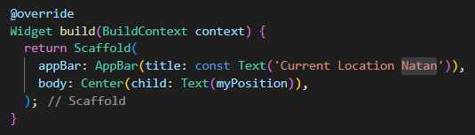

### **Langkah 6**

Panggil screen baru tersebut di file main Anda seperti berikut.
```
home: LocationScreen(),
```
### **Langkah 7**

Run project Anda di device atau emulator (bukan browser), maka akan tampil seperti berikut ini.

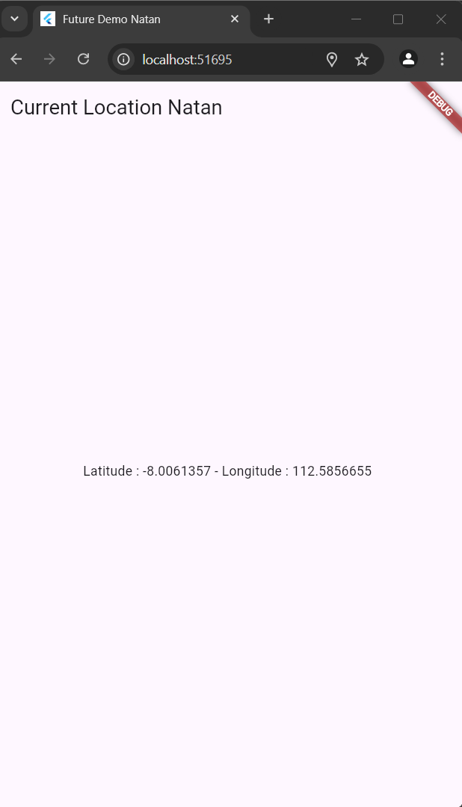

### **Langkah 8**

Tambahkan widget loading seperti kode berikut. Lalu hot restart, perhatikan perubahannya.
```
@override
  Widget build(BuildContext context) {
    final myWidget =
        myPosition == '' 
        ? const CircularProgressIndicator() 
        : Text(myPosition);

    return Scaffold(
      appBar: AppBar(title: const Text('Current Location Natan')),
      body: Center(child: myWidget),
    );
  }
```
### ```Soal 12```
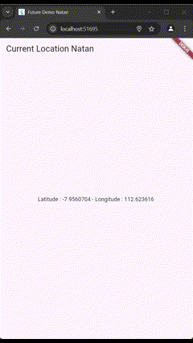

* Jika Anda tidak melihat animasi loading tampil, kemungkinan itu berjalan sangat cepat. Tambahkan delay pada method getPosition() dengan kode await Future.delayed(const Duration(seconds: 3));

**jawab**
```
Future<Position> getPosition() async {
    await Future.delayed(const Duration(seconds: 3));
```

* Apakah Anda mendapatkan koordinat GPS ketika run di browser? Mengapa demikian?

**jawab**

karena adanya izin yang disetujui untuk mengakses lokasi d browser, jadi dapat mengambil titik kordinat

## **Praktikum 7**

### **Langkah 1**

Buka file geolocation.dart kemudian ganti isi method dengan kode ini.
```
Future<Position> getPosition() async {
    await Geolocator.isLocationServiceEnabled();
    await Future.delayed(const Duration(seconds: 3));
    Position position = await Geolocator.getCurrentPosition();
    return position;
  }
```
### **Langkah 2**

Tambah variabel ini di class _LocationScreenState
```
class _LocationScreenState extends State<LocationScreen> {
  String myPosition = '';

  Future<Position>? position;
```
### **Langkah 3**

Tambah method ini dan set variabel position
```
 @override
  void initState() {
    super.initState();
    position = getPosition();
```
### **Langkah 4**

Ketik kode berikut dan sesuaikan. Kode lama bisa Anda comment atau hapus.
```
@override
  Widget build(BuildContext context) {
    return Scaffold(
        appBar: AppBar(title: Text('Current Location Natan')),
        body: Center(
          child: FutureBuilder(
              future: position,
              builder:
                  (BuildContext context, AsyncSnapshot<Position> Snapshot) {
                if (Snapshot.connectionState == ConnectionState.waiting) {
                  return const CircularProgressIndicator();
                } else if (Snapshot.connectionState == ConnectionState.done) {
                  return Text(Snapshot.data.toString());
                } else {
                  return const Text('');
                }
              }
          ),
        )
      );
  }
```

### ```Soal 13```
Apakah ada perbedaan UI dengan praktikum sebelumnya? Mengapa demikian?

**jawab**

secara ui tidak ada tampak perubahan di tampilannya karena fungsionalitas akhirnya sama-sama menampilkan data posisi sama seperti sebelumnya

### **Langkah 5**

Tambahkan kode berikut untuk menangani ketika terjadi error. Kemudian hot restart.
```
 else if (Snapshot.connectionState == ConnectionState.done) {
                  if (Snapshot.hasError) {
                    return Text('Something terrible happened!');
                  }
                  return Text(Snapshot.data.toString());
                }
```
### ```Soal 14```
Apakah ada perbedaan UI dengan praktikum sebelumnya? Mengapa demikian?

**jawab**

sejauh ini yang saya run kode saya tidak terjadi perubahan pada ui nya, namun pada konteks penambahan kode sebelumnya di harapkan akan ada tampilan pesan error saat programnya tidak dapat menampilkan titik kordinat alias saat ada kesalahan

## **Praktikum 8**

### **Langkah 1**

Buatlah file baru navigation_first.dart di project lib Anda.

### **Langkah 2**

Isi kode navigation_first.dart
```
import 'package:flutter/material.dart';

class NavigationFirst extends StatefulWidget{
  const NavigationFirst({super.key});

  @override
  State<NavigationFirst> createState() => _NavigationFirstState();
}

class _NavigationFirstState extends State<NavigationFirst> {
  Color color = Colors.blue.shade700;
  @override
  Widget build(BuildContext context){
    return Scaffold(
      backgroundColor: color,
      appBar: AppBar(
        title: const Text('Navigation First Screen Natan'),
      ),
      body: Center(
        child: ElevatedButton(
          child: const Text('Change Color'),
          onPressed: () {
            _NavigateAndGetColor(context);
          },
        ),
      ),
    );
  }
}
```

### ```Soal 15```
Tambahkan nama panggilan Anda pada tiap properti title sebagai identitas pekerjaan Anda.
```
title: const Text('Navigation First Screen Natan'),
```

### **Langkah 3**
Tambah method di class _NavigationFirstState
```
Future _navigateAndGetColor(BuildContext context) async {
    color = await Navigator.push(
      context,
      MaterialPageRoute(builder: (context) => const NavigationSecond()),
    ) ?? Colors.blue;
    setState(() {});
  }
```
### **Langkah 4**
Buat file baru navigation_second.dart

### **Langkah 5**
Buat class NavigationSecond dengan StatefulWidget
```
import 'package:flutter/material.dart';

class NavigationSecond extends StatefulWidget {
  const NavigationSecond({super.key});

  @override
  State<NavigationSecond> createState() => _NavigationSecondState();
}

class _NavigationSecondState extends State<NavigationSecond> {
  @override
  Widget build(BuildContext context) {
    return Scaffold(
      appBar: AppBar(
        title: const Text('Navigation Second Screen Natan'),
      ),
      body: Center(
        child: Column(
          mainAxisAlignment: MainAxisAlignment.center,
          children: [
            Padding(
              padding: const EdgeInsets.symmetric(vertical: 20.0, horizontal: 50.0),
              child: ElevatedButton(
                child: const Text('Blue'),
                onPressed: () {
                  Navigator.pop(context, Colors.blue);
                },
              ),
            ),
            Padding(
              padding: const EdgeInsets.symmetric(vertical: 20.0, horizontal: 50.0),
              child: ElevatedButton(
                child: const Text('Red'),
                onPressed: () {
                  Navigator.pop(context, Colors.red);
                },
              ),
            ),
            Padding(
              padding: const EdgeInsets.symmetric(vertical: 20.0, horizontal: 50.0),
              child: ElevatedButton(
                child: const Text('Green'),
                onPressed: () {
                  Navigator.pop(context, Colors.green);
                },
              ),
            ),
          ],
        ),
      ),
    );
  }
}

```
### **Langkah 6**
Edit main.dart
Lakukan edit properti home.
```
home: const NavigationFirst(),
```

### **Langkah 7**
Lakukan run, jika terjadi error silakan diperbaiki.


### ```Soal 16```
* Cobalah klik setiap button, apa yang terjadi ? Mengapa demikian ?

**jawab**

Ketika kita mengklik salah satu tombol, aplikasi akan menjalankan Navigator.pop() dengan warna yang sesuai sebagai parameter (misalnya, Colors.blue, Colors.red, atau Colors.green). Fungsi Navigator.pop() ini mengembalikan nilai tersebut ke layar pertama (di mana tombol pertama kali ditekan). Di layar pertama, warna latar belakang diubah sesuai dengan warna yang dikembalikan oleh tombol yang dipilih. Proses ini terjadi karena layar pertama menunggu nilai yang dipilih dari layar kedua menggunakan await pada Navigator.push() yang sebelumnya dipanggil di layar pertama.

* Gantilah 3 warna pada langkah 5 dengan warna favorit Anda!dentitas pekerjaan Anda.


## **Praktikum 9**

### **Langkah 1**
Buat file dart baru di folder lib project Anda navigation_dialog.dart.

### **Langkah 2**
Isi kode navigation_dialog.dart
```
import 'package:flutter/material.dart';

class NavigationDialogScreen extends StatefulWidget{
  const NavigationDialogScreen ({super.key});

  @override
  State<NavigationDialogScreen> createState() => _NavigationDialogScreenState();
}

class _NavigationDialogScreenState extends State<NavigationDialogScreen> {
  Color color = Colors.blue.shade700;
  
  @override
  Widget build(BuildContext context) {
    return Scaffold(
      backgroundColor: color,
      appBar: AppBar(
        title: const Text('Navigation Dialog Screen Natan'),
      ),
      body: Center(
        child: ElevatedButton(
          child: const Text('Change Color'),
          onPressed: () {},
        ),
      ),
    );
  }
}
```
### **Langkah 3**
Tambah method async
```
Future _showColorDialog(BuildContext context) async {
    await showDialog(
      barrierDismissible: false,
      context: context,
      builder: (_) {
        return AlertDialog(
          title: const Text('Very important question'),
          content: const Text('Please choose a color'),
          actions: <Widget>[
            TextButton(
              child: const Text('Red'),
              onPressed: () {
                setState(() {
                  color = Colors.red.shade700;
                });
                Navigator.pop(context, color);
              },
            ),
            TextButton(
              child: const Text("Green"),
              onPressed: () {
                setState(() {
                  color = Colors.green.shade700;
                });
                Navigator.pop(context, color);
              },
            ),
            TextButton(
              child: const Text('Blue'),
              onPressed: () {
                setState(() {
                  color = Colors.blue.shade700;
                });
                Navigator.pop(context, color);
              },
            ),
          ],
        );
      },
    );
    setState(() {});
  }
```
### **Langkah 4**
Panggil method di ElevatedButton
```
_showColorDialog(context);
```
### **Langkah 5**
Ubah properti home
```
home: const NavigationDialogScreen(),
```

### **Langkah 6**
run


### ```Soal 17```
* Cobalah klik setiap button, apa yang terjadi ? Mengapa demikian ?

**jawab**

Ketika kita mengklik tombol "Change Color," aplikasi akan memanggil metode _showColorDialog(), yang menampilkan dialog dengan pilihan warna. Dialog ini menampilkan judul "Very important question" dan pesan "Please choose a color," dengan tiga opsi warna: Red, Green, dan Blue.

Saat kita mengklik salah satu opsi warna, aplikasi menjalankan Navigator.pop(context, color) dengan warna yang dipilih sebagai nilai. Setelah warna dipilih, setState() dipanggil untuk memperbarui variabel color, yang mengubah warna latar belakang layar sesuai pilihan (misalnya, warna latar belakang menjadi merah jika warna "Red" dipilih). Dialog kemudian tertutup, dan layar kembali menampilkan warna yang telah diubah sesuai pilihan pengguna.

* Gantilah 3 warna pada langkah 3 dengan warna favorit Anda!

