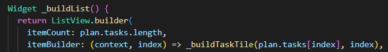

# **Dasar State Management**

## **Pratikum 1**

### **Langkah 1**

Buatlah sebuah project flutter baru dengan nama master_plan di folder src week-11 repository GitHub Anda. Lalu buatlah susunan folder dalam project seperti gambar berikut ini.


### **Langkah 2**

Praktik terbaik untuk memulai adalah pada lapisan data (data layer). Ini akan memberi Anda gambaran yang jelas tentang aplikasi Anda, tanpa masuk ke detail antarmuka pengguna Anda. Di folder model, buat file bernama task.dart dan buat class Task. Class ini memiliki atribut description dengan tipe data String dan complete dengan tipe data Boolean, serta ada konstruktor. Kelas ini akan menyimpan data tugas untuk aplikasi kita. Tambahkan kode berikut:


### **Langkah 3**

Kita juga perlu sebuah List untuk menyimpan daftar rencana dalam aplikasi to-do ini. Buat file plan.dart di dalam folder models dan isi kode seperti berikut.


### **Langkah 4**

Kita dapat membungkus beberapa data layer ke dalam sebuah file yang nanti akan mengekspor kedua model tersebut. Dengan begitu, proses impor akan lebih ringkas seiring berkembangnya aplikasi. Buat file bernama data_layer.dart di folder models. Kodenya hanya berisi export seperti berikut.


### **Langkah 5**

Ubah isi kode main.dart sebagai berikut.


### **Langkah 6**

Pada folder views, buatlah sebuah file plan_screen.dart dan gunakan templat StatefulWidget untuk membuat class PlanScreen. Isi kodenya adalah sebagai berikut. Gantilah teks ‘Namaku' dengan nama panggilan Anda pada title AppBar.


### **Langkah 7**

Anda akan melihat beberapa error di langkah 6, karena method yang belum dibuat. Ayo kita buat mulai dari yang paling mudah yaitu tombol Tambah Rencana. Tambah kode berikut di bawah method build di dalam class _PlanScreenState.


### **Langkah 8**

Kita akan buat widget berupa List yang dapat dilakukan scroll, yaitu ListView.builder. Buat widget ListView seperti kode berikut ini.



### **Langkah 9**

Dari langkah 8, kita butuh ListTile untuk menampilkan setiap nilai dari plan.tasks. Kita buat dinamis untuk setiap index data, sehingga membuat view menjadi lebih mudah. Tambahkan kode berikut ini.

Run atau tekan F5 untuk melihat hasil aplikasi yang Anda telah buat. Capture hasilnya untuk soal praktikum nomor 4.


### **Langkah 10**

Anda dapat menambah tugas sebanyak-banyaknya, menandainya jika sudah beres, dan melakukan scroll jika sudah semakin banyak isinya. Namun, ada salah satu fitur tertentu di iOS perlu kita tambahkan. Ketika keyboard tampil, Anda akan kesulitan untuk mengisi yang paling bawah. Untuk mengatasi itu, Anda dapat menggunakan ScrollController untuk menghapus focus dari semua TextField selama event scroll dilakukan. Pada file plan_screen.dart, tambahkan variabel scroll controller di class State tepat setelah variabel plan.


### **Langkah 11**

Tambahkan method initState() setelah deklarasi variabel scrollController seperti kode berikut.


### **Langkah 12**

Tambahkan controller dan keyboard behavior pada ListView di method _buildList seperti kode berikut ini.


### **Langkah 13**

Terakhir, tambahkan method dispose() berguna ketika widget sudah tidak digunakan lagi.


### **Langkah 14**

Lakukan Hot restart (bukan hot reload) pada aplikasi Flutter Anda. Anda akan melihat tampilan akhir seperti gambar berikut. Jika masih terdapat error, silakan diperbaiki hingga bisa running.


## **Tugas 1**

1. Selesaikan langkah-langkah praktikum tersebut, lalu dokumentasikan berupa GIF hasil akhir praktikum beserta penjelasannya di file README.md! Jika Anda menemukan ada yang error atau tidak berjalan dengan baik, silakan diperbaiki.


2. Jelaskan maksud dari langkah 4 pada praktikum tersebut! Mengapa dilakukan demikian?

**jawab**

File data_layer.dart ini saya buat untuk memudahkan impor model ke seluruh aplikasi. Jadi, saya cukup mengekspor plan.dart dan task.dart dari satu file saja, 
Dengan begitu, di tempat lain saya hanya perlu mengimpor data_layer.dart, dan secara otomatis bisa akses semua model (seperti Plan dan Task). Ini menyederhanakan kode dan membuatnya lebih terorganisir, terutama kalau nanti model-model lain ditambahkan.


3. Mengapa perlu variabel plan di langkah 6 pada praktikum tersebut? Mengapa dibuat konstanta ?

**jawab**

Variabel plan pada langkah tersebut digunakan untuk menyimpan data dari rencana (plan) dan daftar tugas (tasks) yang akan ditampilkan di layar. Ini adalah model data utama yang mengelola apa saja tugas yang dimiliki pengguna dan apakah tugas-tugas tersebut sudah selesai atau belum. Tanpa variabel plan, aplikasi tidak akan memiliki tempat untuk menyimpan informasi ini, sehingga tidak akan ada data yang bisa ditampilkan atau diubah.

Mengapa plan dibuat sebagai konstanta (const Plan())?

* Efisiensi: Dengan menggunakan const Plan(), objek Plan yang awalnya kosong dibuat secara konstan dan dioptimalkan oleh Flutter. Karena Plan awalnya tidak berubah dan hanya berisi daftar tugas kosong, menandainya dengan const memungkinkan aplikasi menghemat memori dan menghindari pembuatan ulang objek berulang-ulang ketika tidak ada perubahan data.

* Immutability (Tidak Dapat Diubah): Ini membantu dalam mengelola status secara lebih aman. Setiap kali ada perubahan pada data plan, objek Plan yang baru dibuat, bukan mengubah objek yang ada. Pendekatan ini mencegah perubahan tak terduga (side effects) pada objek yang sama, yang sering terjadi dalam aplikasi dengan status dinamis seperti ini.

4. Lakukan capture hasil dari Langkah 9 berupa GIF, kemudian jelaskan apa yang telah Anda buat!


**jawab**

yang saya buat:

* Halaman Utama Aplikasi:

Aplikasi Flutter dimulai dengan PlanScreen sebagai halaman utamanya, yang ditentukan di home: PlanScreen() dalam main.dart.

* Menampilkan Daftar Tugas:

Di layar utama PlanScreen, terdapat AppBar dengan judul "Master Plan Yonatan Efrassetyo".
Di bawahnya, sebuah list dari tugas-tugas (Task) ditampilkan menggunakan ListView.builder(), yang akan menampilkan tugas-tugas yang disimpan di dalam variabel plan (yang awalnya kosong).

* Menambahkan Tugas Baru:

Ada sebuah tombol FloatingActionButton dengan ikon “+”. Setiap kali kamu menekan tombol ini, sebuah tugas baru ditambahkan ke daftar tasks dalam variabel plan.
Setiap tugas baru ditambahkan dengan nilai default: deskripsi kosong (description: '') dan status belum selesai (complete: false).

* Mengelola Status Tugas:

Setiap tugas yang ada di daftar ditampilkan dalam bentuk ListTile dengan dua komponen utama:
Checkbox: Untuk menandai apakah tugas sudah selesai. Ketika diubah, status complete dari tugas tersebut akan diperbarui menggunakan setState() untuk memperbarui UI.
TextFormField: Ini adalah input field yang memungkinkan pengguna mengubah deskripsi tugas. Setiap perubahan teks juga disimpan ke variabel plan melalui setState().

5. Apa kegunaan method pada Langkah 11 dan 13 dalam lifecyle state ?

**jawab**

* *initState()*
. Method ini dipanggil sekali saat state dari StatefulWidget pertama kali diinisialisasi. Ini biasanya digunakan untuk melakukan inisialisasi awal yang hanya perlu dilakukan sekali seumur hidup dari objek State, seperti membuat instansi dari objek yang tidak berubah selama state tersebut aktif (misalnya, controller).

* *dispose()* . Method ini dipanggil ketika State dari StatefulWidget akan dihapus, yaitu saat widget tersebut dihapus dari pohon widget. Ini adalah tempat yang tepat untuk membersihkan sumber daya, seperti menghentikan controller atau listener yang telah dibuat, agar tidak terjadi kebocoran memori (memory leaks).

* *kesimpulan*
initState(): Digunakan untuk melakukan inisialisasi awal, dalam kasus ini membuat dan menyiapkan ScrollController.
dispose(): Digunakan untuk membersihkan atau membebaskan sumber daya ketika widget akan dihapus, seperti menghentikan ScrollController.


6. Kumpulkan laporan praktikum Anda berupa link commit atau repository GitHub ke spreadsheet yang telah disediakan!

## **Pratikum 2**

### **Langkah 1**

Buat folder baru provider di dalam folder lib, lalu buat file baru dengan nama plan_provider.dart berisi kode seperti berikut.


### **Langkah 2**

Gantilah pada bagian atribut home dengan PlanProvider seperti berikut. Jangan lupa sesuaikan bagian impor jika dibutuhkan.


### **Langkah 3**

Tambahkan dua method di dalam model class Plan seperti kode berikut.


### **Langkah 4**

Edit PlanScreen agar menggunakan data dari PlanProvider. Hapus deklarasi variabel plan (ini akan membuat error). Kita akan perbaiki pada langkah 5 berikut ini.


### **Langkah 5**

Tambahkan BuildContext sebagai parameter dan gunakan PlanProvider sebagai sumber datanya. Edit bagian kode seperti berikut.


### **Langkah 6**

Tambahkan parameter BuildContext, gunakan PlanProvider sebagai sumber data. Ganti TextField menjadi TextFormField untuk membuat inisial data provider menjadi lebih mudah.


### **Langkah 7**

Sesuaikan parameter pada bagian _buildTaskTile seperti kode berikut.


### **Langkah 8**

Edit method build sehingga bisa tampil progress pada bagian bawah (footer). Caranya, bungkus (wrap) _buildList dengan widget Expanded dan masukkan ke dalam widget Column seperti kode pada Langkah 9.


### **Langkah 9**

Terakhir, tambahkan widget SafeArea dengan berisi completenessMessage pada akhir widget Column. Perhatikan kode berikut ini.


## **Tugas 2**

1. Selesaikan langkah-langkah praktikum tersebut, lalu dokumentasikan berupa GIF hasil akhir praktikum beserta penjelasannya di file README.md! Jika Anda menemukan ada yang error atau tidak berjalan dengan baik, silakan diperbaiki sesuai dengan tujuan aplikasi tersebut dibuat.


2. Jelaskan mana yang dimaksud InheritedWidget pada langkah 1 tersebut! Mengapa yang digunakan InheritedNotifier?

**jawab**

Pada Langkah 1, yang dimaksud dengan InheritedWidget adalah kelas yang digunakan untuk berbagi state atau data antar widget dalam pohon widget Flutter. InheritedWidget memungkinkan widget anak (child) untuk mendapatkan akses ke data atau objek yang disediakan oleh widget orang tua (parent) tanpa perlu langsung mengoper data secara eksplisit melalui constructor ke semua widget di bawahnya.

Dalam langkah 1, kelas PlanProvider adalah subclass dari InheritedNotifier. InheritedNotifier sendiri merupakan turunan dari InheritedWidget, tetapi memiliki fungsi tambahan untuk mendengarkan perubahan dari sebuah Notifier, seperti ValueNotifier yang digunakan di sini.

Mengapa digunakan InheritedNotifier?

* InheritedNotifier adalah kombinasi dari InheritedWidget dan Listenable, seperti ValueNotifier. Ini sangat berguna ketika kita ingin widget di dalam pohon mendapatkan notifikasi tentang perubahan data yang di-listen.
* InheritedNotifier digunakan untuk mengoptimalkan pembaruan UI. Ketika ValueNotifier yang diberikan berubah, hanya widget-widget yang berlangganan (yang memanggil dependOnInheritedWidgetOfExactType) yang akan dibangun ulang. Ini lebih efisien dibandingkan dengan menggunakan InheritedWidget biasa, karena kita hanya memperbarui bagian UI yang terkait dengan perubahan tersebut.

3. Jelaskan maksud dari method di langkah 3 pada praktikum tersebut! Mengapa dilakukan demikian?

**jawab**

Pada Langkah 3, dua method ditambahkan:

* completedCount:

untuk menghitung jumlah tugas yang sudah selesai dengan memfilter tasks yang complete-nya true.

* completenessMessage:

untuk menghasilkan pesan berisi jumlah tugas selesai dan total tugas, misalnya "3 out of 5 tasks."

Keduanya mempermudah akses data progres tugas tanpa harus menulis ulang logika di banyak tempat, meningkatkan efisiensi dan kemudahan pemeliharaan.

4. Lakukan capture hasil dari Langkah 9 berupa GIF, kemudian jelaskan apa yang telah Anda buat!


**jawab**

yang saya buat:

* Penggunaan Provider untuk Manajemen State:

Saya mengganti cara manajemen state menjadi lebih efisien dengan menggunakan InheritedNotifier melalui PlanProvider. Dengan cara ini, saya bisa mengakses dan memperbarui data Plan dari berbagai widget tanpa perlu menggunakan metode tradisional seperti setState di berbagai tempat. Hal ini juga membuat kode lebih bersih dan terstruktur.

* Menambahkan Tugas Secara Dinamis:

Saya menambahkan kemampuan untuk menambah tugas baru dengan mudah melalui sebuah FloatingActionButton. Saat pengguna menekan tombol ini, tugas baru akan ditambahkan ke dalam daftar dan UI akan otomatis ter-update untuk menampilkan tugas yang baru saja ditambahkan.

* Menampilkan Pesan Progress (Completeness Message):

Fitur tambahan yang saya tambahkan adalah kemampuan untuk menampilkan progres penyelesaian tugas. Saya membuat method completenessMessage yang menampilkan jumlah tugas yang sudah selesai dari total tugas yang ada, misalnya "3 out of 5 tasks". Pesan ini muncul di bagian bawah UI, sehingga pengguna bisa melihat kemajuan mereka secara real-time.

Dengan perubahan ini, aplikasi lebih responsif dan data terpusat dikelola dengan baik menggunakan Provider, serta memberikan pengalaman pengguna yang lebih interaktif dalam mengelola tugas.

**jawab**

5. Kumpulkan laporan praktikum Anda berupa link commit atau repository GitHub ke spreadsheet yang telah disediakan! 

## **Pratikum 3**

### **Langkah 1**

Perhatikan kode berikut, edit class PlanProvider sehingga dapat menangani List Plan.


### **Langkah 2**

Langkah sebelumnya dapat menyebabkan error pada main.dart dan plan_screen.dart. Pada method build, gantilah menjadi kode seperti ini.


### **Langkah 3**

Tambahkan variabel plan dan atribut pada constructor-nya seperti berikut.


### **Langkah 4**

Itu akan terjadi error setiap kali memanggil PlanProvider.of(context). Itu terjadi karena screen saat ini hanya menerima tugas-tugas untuk satu kelompok Plan, tapi sekarang PlanProvider menjadi list dari objek plan tersebut.

### **Langkah 5**

Tambahkan getter pada _PlanScreenState seperti kode berikut.


### **Langkah 6**

Pada bagian ini kode tetap seperti berikut.


### **Langkah 7**

Pastikan Anda telah merubah ke List dan mengubah nilai pada currentPlan seperti kode berikut ini.


### **Langkah 8**

Pastikan ubah ke List dan variabel planNotifier seperti kode berikut ini.


### **Langkah 9**

Pada folder view, buatlah file baru dengan nama plan_creator_screen.dart dan deklarasikan dengan StatefulWidget bernama PlanCreatorScreen. Gantilah di main.dart pada atribut home menjadi seperti berikut.


### **Langkah 10**

Kita perlu tambahkan variabel TextEditingController sehingga bisa membuat TextField sederhana untuk menambah Plan baru. Jangan lupa tambahkan dispose ketika widget unmounted seperti kode berikut.


### **Langkah 11**

Letakkan method Widget build berikut di atas void dispose. Gantilah ‘Namaku' dengan nama panggilan Anda.


### **Langkah 12**

Buatlah widget berikut setelah widget build.


### **Langkah 13**

Tambahkan method berikut untuk menerima inputan dari user berupa text plan.


### **Langkah 14**

Tambahkan widget seperti kode berikut.


### **RUN**


## **Tugas 3**

1. Selesaikan langkah-langkah praktikum tersebut, lalu dokumentasikan berupa GIF hasil akhir praktikum beserta penjelasannya di file README.md! Jika Anda menemukan ada yang error atau tidak berjalan dengan baik, silakan diperbaiki sesuai dengan tujuan aplikasi tersebut dibuat.

2. Berdasarkan Praktikum 3 yang telah Anda lakukan, jelaskan maksud dari gambar diagram berikut ini!


**jawab**

**Diagram Arsitektur Widget Tree Master Plan**

Diagram ini menampilkan arsitektur widget tree serta alur navigasi pada aplikasi Master Plan, yang terdiri dari dua layar utama:

**Sisi Kiri (Biru) - PlanCreatorScreen:**
- `MaterialApp` berfungsi sebagai widget utama
- `PlanProvider` digunakan sebagai manajemen state untuk menyimpan daftar rencana
- `PlanCreatorScreen` sebagai halaman utama yang mencakup:
  - `Column` sebagai layout inti
  - `TextField` untuk input rencana baru
  - `Expanded` dengan `ListView` untuk menampilkan daftar rencana yang telah dibuat

**Sisi Kanan (Hijau) - PlanScreen:**
- `PlanScreen` berperan sebagai halaman detail yang menampilkan tugas dari sebuah rencana
- `Scaffold` sebagai struktur dasar halaman
- `Column` untuk layout yang berisi:
  - `Expanded` dengan `ListView` untuk menampilkan daftar tugas
  - `SafeArea` dengan `Text` untuk menunjukkan pesan kemajuan

Tanda panah "Navigator Push" di tengah menunjukkan navigasi dari `PlanCreatorScreen` ke `PlanScreen` ketika pengguna mengklik salah satu rencana di `ListView`. Implementasi ini dilakukan dengan:

```dart
Navigator.of(context).push(
    MaterialPageRoute(builder: (_) => PlanScreen(plan: plan,))
);
```

Diagram ini mencerminkan konsep "Lift State Up," di mana `PlanProvider` ditempatkan di level atas (`MaterialApp`) sehingga state daftar dapat diakses oleh kedua layar dan dikelola secara terpusat. Hal ini memungkinkan:

- Pembuatan rencana baru di `PlanCreatorScreen`
- Pengeditan tugas di `PlanScreen`
- Sinkronisasi data antara kedua layar melalui `PlanProvider`

Struktur ini menerapkan manajemen state yang efektif untuk aplikasi dengan berbagai layar sambil tetap menjaga konsistensi data di seluruh aplikasi.

3. Lakukan capture hasil dari Langkah 14 berupa GIF, kemudian jelaskan apa yang telah Anda buat!


**jawab**

yang saya buat:

sama seperti praktikum 2 , disini saya menambahkan menu untuk menamabahkan beberapa plan yang mana di praktikum 2 hanya ada 1 plan dan mengisi beberapa task, pada praktikum ini saya menambahkan fitur bisa menambahkan banyak plan

4. Kumpulkan laporan praktikum Anda berupa link commit atau repository GitHub ke spreadsheet yang telah disediakan!