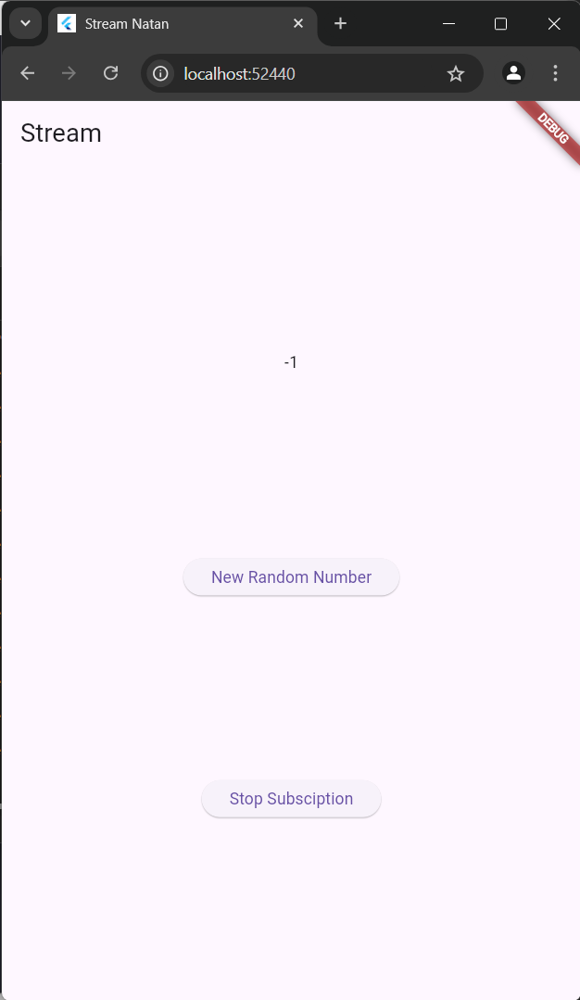
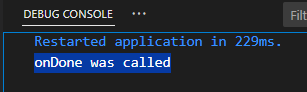

# **Streams**

## **Pratikum 1**

### **Langkah 1**

Buatlah sebuah project flutter baru dengan nama stream_nama (beri nama panggilan Anda) di folder week-13/src/ repository GitHub Anda

### **Langkah 2**

Ketiklah kode main.dart seperti berikut ini.

```
import 'package:flutter/material.dart';

void main() {
  runApp(const MyApp());
}

class MyApp extends StatelessWidget {
  const MyApp({super.key});

  @override
  Widget build(BuildContext context) {
    return MaterialApp(
      title: 'Stream',
      theme: ThemeData(
        primarySwatch: Colors.deepPurple
      ),
      home: const StreamHomepage(),
    );
  }
}

class StreamHomepage extends StatefulWidget {
  const StreamHomepage({super.key});

  @override
  State<StreamHomepage> createState() => _StreamHomepageState();
}

class _StreamHomepageState extends State<StreamHomepage> {

  @override
  Widget build(BuildContext context) {
    return Container();
  }
}

```

### ```Soal 1```

* Tambahkan nama panggilan Anda pada title app sebagai identitas hasil pekerjaan Anda.
Gantilah warna tema aplikasi sesuai kesukaan Anda.
```
return MaterialApp(
      title: 'Stream Natan',
```
* Tambahkan nama panggilan Anda pada title app sebagai identitas hasil pekerjaan Anda. Gantilah warna tema aplikasi sesuai kesukaan Anda.
```
theme: ThemeData(
        primarySwatch: Colors.pink
      ),
```
### **Langkah 3**

Buat file baru di folder lib project Anda. Lalu isi dengan kode berikut.

```
import 'package:flutter/material.dart';

class ColorStream{
  
}
```

### **Langkah 4**

Tambahkan variabel di dalam class ColorStream seperti berikut.

```
class ColorStream{
  final List<Color> colors = [
    Colors.blueGrey,
    Colors.amber,
    Colors.deepPurple,
    Colors.lightBlue,
    Colors.teal,
    
  ];
}
```

### ```Soal 2```

* Tambahkan 5 warna lainnya sesuai keinginan Anda pada variabel colors tersebut.
```
class ColorStream{
  final List<Color> colors = [
    Colors.blueGrey,
    Colors.amber,
    Colors.deepPurple,
    Colors.lightBlue,
    Colors.teal,
    Colors.lightGreen,
    Colors.deepOrange,
    Colors.redAccent,
    Colors.lightBlueAccent,
    Colors.pinkAccent,
  ];
}
```
### **Langkah 5**

Di dalam class ColorStream ketik method seperti kode berikut. Perhatikan tanda bintang di akhir keyword async* (ini digunakan untuk melakukan Stream data)

```
Stream<Color> getColors() async* {
    
  }
```

### **Langkah 6**

Tambahkan kode berikut ini.

```
Stream<Color> getColors() async* {
    yield* Stream.periodic(const Duration(seconds: 1), (int t) {
      int index = t % colors.length;
      return colors[index];
    });
  }
```

### ```Soal 3```

* Jelaskan fungsi keyword yield* pada kode tersebut!

**jawab**

fungsinya adalah Keyword yield* digunakan untuk menghasilkan (men-yield) nilai dari stream lain atau generator lain di dalam sebuah stream. Dalam kode ini, yield* digunakan untuk men-yield setiap nilai dari stream yang dihasilkan oleh Stream.periodic. Dengan keyword yield*, kita dapat menggabungkan hasil dari stream lain ke dalam aliran stream ini tanpa harus menangani nilai individualnya secara manual.

* Apa maksud isi perintah kode tersebut?

**jawab**

Kode ini akan menghasilkan warna dari daftar colors satu per satu, berulang setiap detik. Setelah mencapai warna terakhir, stream akan kembali ke warna pertama dalam daftar, lalu melanjutkan lagi sesuai urutan, sehingga terus berputar tanpa henti setiap detiknya.

### **Langkah 7**

Ketik kode impor file ini pada file main.dart

```
import 'stream.dart';
```

### **Langkah 8**

Ketik dua properti ini di dalam class _StreamHomePageState

```
  Color bgColor = Colors.blueGrey;
  late ColorStream colorStream;
```

### **Langkah 9**

Tetap di file main, Ketik kode seperti berikut

```
  void changeColor() async {
    await for (var eventColor in colorStream.getColors()) {
      setState(() {
        bgColor = eventColor;
      });
    }
    }
```

### **Langkah 10**

Ketika kode seperti berikut

```
  @override
  void initState() {
    super.initState();
    colorStream = ColorStream();
    changeColor();
  }
```

### **Langkah 11**

Sesuaikan kode seperti berikut.

```
  @override
  Widget build(BuildContext context) {
    return Scaffold(
      appBar: AppBar(
        title: const Text('Stream'),
      ),
      body: Container(
        decoration: BoxDecoration(color: bgColor),
      ),
    );
  }
```

### **Langkah 12**

Lakukan running pada aplikasi Flutter Anda, maka akan terlihat berubah warna background setiap detik.

### ```Soal 4```

* Capture hasil praktikum Anda berupa GIF dan lampirkan di README.


### **Langkah 13**

Anda boleh comment atau hapus kode sebelumnya, lalu ketika kode seperti berikut.

```
  void changeColor() async {
    colorStream.getColors().listen((eventColor) {
      setState(() {
        bgColor = eventColor;
      });
    });
  }
```

### ```Soal 5```

* Jelaskan perbedaan menggunakan listen dan await for (langkah 9) !

**jawab**

Perbedaan utama antara menggunakan listen dan await for untuk mendengarkan stream terletak pada cara penanganan data dan sifat asinkron masing-masing:

1. Menggunakan await for (Langkah 9):

- Dengan await for, fungsi changeColor menjadi asinkron (async) dan menunggu setiap item yang dihasilkan oleh stream satu per satu.
- await for akan menghentikan eksekusi fungsi tersebut hingga ada data baru dari stream.
- Pendekatan ini sangat berguna ketika kita perlu memproses data secara berurutan dan ingin menjalankan kode lainnya hanya setelah item diterima.

2. Menggunakan listen (Langkah 13):

- listen langsung mendaftarkan listener pada stream tanpa menunggu, sehingga changeColor tidak perlu menunggu data dari stream untuk selesai (fungsi ini bisa berjalan sinkron).
- Dengan listen, stream akan mengirim data ke callback setiap kali ada pembaruan tanpa menunggu seluruh fungsi selesai, memungkinkan aplikasi untuk terus melakukan tugas lain.
- listen lebih fleksibel karena memungkinkan penambahan fitur lain, seperti onDone atau onError, untuk menangani akhir stream atau error yang mungkin terjadi.

## **Pratikum 2**

### **Langkah 1**

Buka file stream.dart Lakukan impor dengan mengetik kode ini.
```
import 'dart:async';
```

### **Langkah 2**

Tambah class NumberStream, Tetap di file stream.dart tambah class baru seperti berikut
```
class NumberStream{
  
}
```

### **Langkah 3**

Tambah StreamController
Di dalam class NumberStream buatlah variabel seperti berikut.
```
class NumberStream{
  final StreamController<int> controller = StreamController<int>();
}
```

### **Langkah 4**

Tambah method addNumberToSink
Tetap di class NumberStream buatlah method ini
```
void addNumberToSink(int newNumber) {
    controller.sink.add(newNumber);
  }
```
### **Langkah 5**

Tambah method close()
```
close(){
    controller.close();
  }
```

### **Langkah 6**

buka main.dart Ketik kode import seperti berikut
```
import 'dart:async';
import 'dart:math';
```
### **Langkah 7**

Tambah variabel Di dalam class _StreamHomePageState ketik variabel berikut
```
int lastNumber = 0;
  late StreamController numberStreamController;
  late NumberStream numberStream;
```

### **Langkah 8**

Edit initState()
```
  @override
  void initState() {
    numberStream = NumberStream();
    numberStreamController = numberStream.controller;
    Stream stream = numberStreamController.stream;
    stream.listen((event) {
      setState(() {
        lastNumber = event;
      });
    });
    super.initState();
  }
```

### **Langkah 9**

tambah dispose()
```
@override
  void dispose() {
    numberStreamController.close();
    super.dispose();
  }
```

### **Langkah 10**

Tambah method addRandomNumber()
```
void addRandomNumber() {
    Random random = Random();
    int myNum = random.nextInt(10);
    numberStream.addNumberToSink(myNum);
  }
```

### **Langkah 11**

Edit method build()
```
  @override
  Widget build(BuildContext context) {
    return Scaffold(
      appBar: AppBar(
        title: const Text('Stream'),
      ),
      body: SizedBox(
        width: double.infinity,
        child: Column(
          mainAxisAlignment: MainAxisAlignment.spaceEvenly,
          crossAxisAlignment: CrossAxisAlignment.center,
          children: [
            Text(lastNumber.toString()),
            ElevatedButton(
              onPressed: () => addRandomNumber(),
              child: Text('New Random Number'),
            )
          ],
        ),
      ),
    );
  }
```

### **Langkah 12**

Run

### ```Soal 6```

Jelaskan maksud kode langkah 8 dan 10 tersebut!

**jawab**

* Langkah 8 mengatur pendengar untuk menangani data baru dari stream dan memperbarui UI setiap kali ada angka baru.
* Langkah 10 menghasilkan angka baru dan mengirimkannya ke stream, sehingga UI akan menampilkan angka acak yang baru.

Capture hasil praktikum Anda berupa GIF dan lampirkan di README.


### **Langkah 13**

Buka stream.dart
Tambahkan method berikut ini.
```
addError(){
    controller.sink.addError('error');
  }
```

### **Langkah 14**

Buka main.dart Tambahkan method onError di dalam class StreamHomePageState pada method listen di fungsi initState() seperti berikut ini.
```
    stream.listen((event) {
      setState(() {
        lastNumber = event;
      });
    }).onError((error) {
      setState(() {
        lastNumber = -1;
      });
    });
```

### **Langkah 15**

Lakukan comment pada dua baris kode berikut, lalu ketik kode seperti berikut ini.
```
  void addRandomNumber() {
    Random random = Random();
    // int myNum = random.nextInt(10);
    // numberStream.addNumberToSink(myNum);
    numberStream.addError();
  }
```

### ```Soal 7```

* Jelaskan maksud kode langkah 8 dan 10 tersebut!

**jawab**

1. Langkah 13: Menambahkan fungsi addError() pada kelas NumberStream untuk mengirimkan error ke stream.

2. Langkah 14: Menangani error yang terjadi pada stream dengan menggunakan .onError() dalam metode listen(). Jika terjadi error, nilai lastNumber akan diubah menjadi -1 untuk menandakan kesalahan.

3. Langkah 15: Memodifikasi fungsi addRandomNumber() untuk memicu error dengan memanggil numberStream.addError(), menggantikan kode yang sebelumnya menghasilkan angka acak.

* Kembalikan kode seperti semula pada Langkah 15, comment addError() agar Anda dapat melanjutkan ke praktikum 3 berikutnya.
```
  void addRandomNumber() {
    Random random = Random();
    int myNum = random.nextInt(10);
    numberStream.addNumberToSink(myNum);
    // numberStream.addError();
  }
```

## **Pratikum 3**

### **Langkah 1**

Buka main.dart Tambahkan variabel baru di dalam class _StreamHomePageState
```
late StreamTransformer transformer;
```
### **Langkah 2**

Tambahkan kode ini di initState
```
transformer = StreamTransformer<int, int>.fromHandlers(
      handleData: (value, sink) {
        sink.add(value * 10);
      },
      handleError: (error, trace, sink) {
        sink.add(-1);
      },
      handleDone: (sink) => sink.close()
    );
```
### **Langkah 3**

Tetap di initState
Lakukan edit seperti kode berikut.
```
stream.transform(transformer).listen((event) {
```
### **Langkah 4**

Run

### ```Soal 8```

* Jelaskan maksud kode langkah 1-3 tersebut!

**jawab**

- Langkah 1: Mendeklarasikan StreamTransformer bertipe int, yang akan digunakan untuk mengubah data dalam aliran stream.

- Langkah 2: Menginisialisasi StreamTransformer dengan logika:

handleData: Mengalikan nilai dalam stream dengan 10.

handleError: Menangani error dengan mengirim nilai -1.

handleDone: Menutup sink saat stream selesai.

* Langkah 3: Menghubungkan stream dengan transformer menggunakan stream.transform(transformer). Hasil transformasi kemudian diproses dalam listener untuk diperbarui ke UI.

* Capture hasil praktikum Anda berupa GIF dan lampirkan di README.


## **Pratikum 4**

### **Langkah 1**

ambah variabel
Tambahkan variabel berikut di class _StreamHomePageState
```
late StreamSubscription subscription;
```
### **Langkah 2**

Edit initState()
Edit kode seperti berikut ini.
```
subscription = stream.listen((event) {
      setState(() {
        lastNumber = event;
      });
    });
```
### **Langkah 3**

Tetap di initState()
Tambahkan kode berikut ini.
```
subscription.onError((error) {
      setState(() {
        lastNumber = -1;
      });
    });
```
### **Langkah 4**

Tambah properti onDone()
Tambahkan dibawahnya kode ini setelah onError
```
subscription.onDone(() {
      print('onDone was called');
    });
```
### **Langkah 5**

Tambah method baru
Ketik method ini di dalam class _StreamHomePageState
```
void stopStream() {
    numberStreamController.close();
  }
```
### **Langkah 6**

Pindah ke method dispose()
Jika method dispose() belum ada, Anda dapat mengetiknya dan dibuat override. Ketik kode ini didalamnya.

### **Langkah 7**

Pindah ke method build()
Tambahkan button kedua dengan isi kode seperti berikut ini.
```
ElevatedButton(
              onPressed: () => stopStream(),
              child: Text('Stop Subsciption'),
            ),
```
### **Langkah 8**

Edit method addRandomNumber()
Edit kode seperti berikut ini.
```
void addRandomNumber() {
    Random random = Random();
    int myNum = random.nextInt(10);
    if (!numberStreamController.isClosed) {
      numberStream.addNumberToSink(myNum);
    } else {
      setState(() {
        lastNumber = -1;
      });
    }
  }
```
### **Langkah 9**

Run. Anda akan melihat dua button seperti gambar berikut.



### **Langkah 10**

Tekan button ‘Stop Subscription'
Anda akan melihat pesan di Debug Console seperti berikut.



### ```Soal 9```

* Jelaskan maksud kode langkah 2, 6 dan 8 tersebut!

**jawab**

- pada langkah 2, Membuat subscription untuk mendengarkan stream dan memperbarui nilai lastNumber setiap kali ada data baru (event) di stream.

- pada langkah 6, Menutup numberStreamController saat widget dihapus (disposed) agar tidak ada kebocoran memori.

- pada langkah 8, Menghasilkan angka acak dan menambahkannya ke stream jika controller belum ditutup. Jika sudah ditutup, lastNumber diset ke -1 untuk menandakan stream tidak aktif.

* Capture hasil praktikum Anda berupa GIF dan lampirkan di README.

