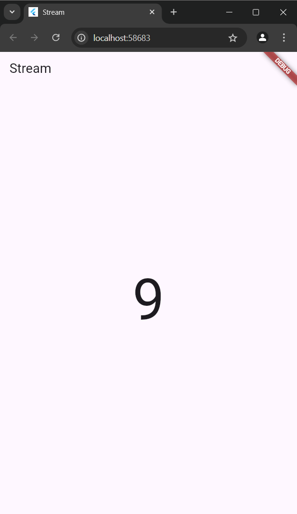

# **Streambuilder_natan**

## **Pratikum 6**

### **Langkah 1**

Buatlah sebuah project flutter baru dengan nama streambuilder_nama (beri nama panggilan Anda)

### **Langkah 2**

Buat file baru stream.dart

### **Langkah 3**

Tetap di file stream.dart Ketik kode seperti berikut
```
import 'dart:math';

class NumberStream{
  Stream<int> getNumber() async* {
    yield* Stream.periodic(const Duration(seconds: 1), (int t) {
      Random random = Random();
      int myNum = random.nextInt(10);
      return myNum;
    });
  }
}
```

### **Langkah 4**

Edit main.dart Ketik kode seperti berikut ini.
```
import 'package:flutter/material.dart';
import 'stream.dart';
import 'dart:async';

void main() {
  runApp(const MainApp());
}

class MainApp extends StatelessWidget {
  const MainApp({super.key});

  @override
  Widget build(BuildContext context) {
    return MaterialApp(
      title: 'Stream',
      theme: ThemeData(
        primarySwatch: Colors.deepPurple
      ),
      home: const StreamHomepage(),
    );
  }
}

class StreamHomepage extends StatefulWidget {
  const StreamHomepage({super.key});

  @override
  State<StreamHomepage> createState() => _StreamHomePageState();
}

class _StreamHomePageState extends State<StreamHomepage> {
  @override
  Widget build(BuildContext) {
    return Scaffold(
      appBar: AppBar(
        title: const Text('Stream'),
      ),
      body: Container(

      ),
    );
  }
}
```

### **Langkah 5**

Tambah variabel Di dalam class _StreamHomePageState, ketika variabel ini.
```
  late Stream<int> numberStream;
```

### **Langkah 6**

Edit initState() Ketik kode seperti berikut.
```
  @override
  void initState() {
    numberStream = NumberStream().getNumber();
    super.initState();
  }
```

### **Langkah 7**

Edit method build()
```
import 'package:flutter/material.dart';
import 'stream.dart';
import 'dart:async';

void main() {
  runApp(const MainApp());
}

class MainApp extends StatelessWidget {
  const MainApp({super.key});

  @override
  Widget build(BuildContext context) {
    return MaterialApp(
      title: 'Stream',
      theme: ThemeData(
        primarySwatch: Colors.deepPurple
      ),
      home: const StreamHomepage(),
    );
  }
}

class StreamHomepage extends StatefulWidget {
  const StreamHomepage({super.key});

  @override
  State<StreamHomepage> createState() => _StreamHomePageState();
}

class _StreamHomePageState extends State<StreamHomepage> {
  @override
  Widget build(BuildContext) {
    return Scaffold(
      appBar: AppBar(
        title: const Text('Stream'),
      ),
      body: StreamBuilder(
        stream: numberStream,
        initialData: 0,
        builder: (context, Snapshot) {
          if (Snapshot.hasError) {
            print('Error');
          }
          if (Snapshot.hasData) {
            return Center(
              child: Text(
                Snapshot.data.toString(),
                  style: const TextStyle(fontSize: 96),
              )
            );
          } else {
            return const SizedBox.shrink();
          }
        },
      ),
    );
  }

  late Stream<int> numberStream;

  @override
  void initState() {
    numberStream = NumberStream().getNumber();
    super.initState();
  }
}
```
### **Langkah 8**

Run. Hasilnya, setiap detik akan tampil angka baru seperti berikut.



### ```Soal 12```

* Jelaskan maksud kode pada langkah 3 dan 7 !

**jawab**

* Langkah 3 menghasilkan stream data berupa angka acak setiap detik.

* Langkah 7 menampilkan data dari stream tersebut secara real-time di layar menggunakan StreamBuilder, menjadikan UI aplikasi bersifat reaktif terhadap data baru.

* Capture hasil praktikum Anda berupa GIF dan lampirkan di README.


